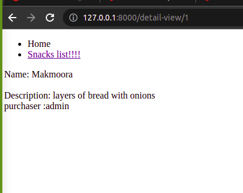
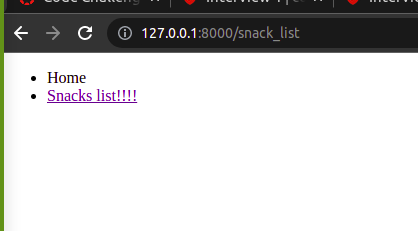
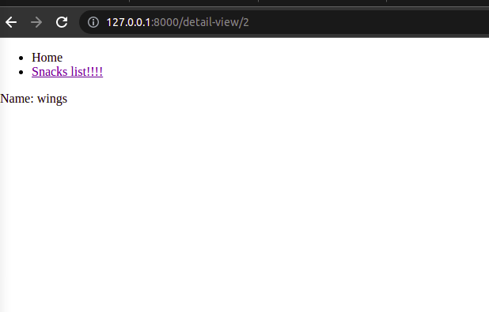

# Lab: Django Models

## Overview

Django has a powerful Object Relational Mapper that allows us to persist data using Python instead of SQL.

Today you'll build out a project with one model and wire up that model using Django Views.

## Feature Tasks and Requirements

### Model

- create `snack_tracker_project` project
  - This will involve some preliminary steps.
  - Review previous class lab for details.
- create `snacks` app
- Add `snacks` app to project
- create `Snack` model
  - make sure it extends from proper base class
  - add `name` as a CharField with maximum length of 64 characters.
  - add `purchaser` ForeignKey related to Django's built in user model with CASCADE delete option.
    - `from django.contrib.auth import get_user_model`
  - add `description` TextField
- add model to admin
- modify `Snack` model have user friendly display in admin
- create migrations and migrate data
- create a super user
- run development server
- Add a few snacks via Admin panel
- create another user and more snacks via Admin panel
- confirm that snacks behave as expected with proper name, purchaser and description.
- Looks like your model in good shape. Congrats!

### Views for Snacks App

- Where to create these views?
  - Dig around and see if there's a sensible spot.
  - **HINT** There is **one** correct place for your app's views.
- create `SnackListView`
  - extend `ListView`
  - give a template of `snack_list.html`
  - associate `Snack` model
- update url patterns for project
  - empty path should `include` snacks.urls
- update snacks app urls
  - empty sub-path should be handled by SnackListView
    - Don't forget to use `as_view()`
- add detail view
  - link `snack_detail.html` template
  - associate `Snack` model
- update app urlpatterns to handle detail view
  - account for primary key in url
  - path would look like `localhost:8000/1/` to get to snack with id of 1

### Templates

- Add`templates` folder in root of project
  - register `templates` folder in project settings TEMPLATES section
- create `base.html` ancestor template
  - add main html document
  - use `Django Templating Language` to allow child templates to insert content
- create `snack_list.html` template
  - extend base template
  - use `Django Templating Language` to display each snack's name
- view home page (aka snack_list) and confirm snacks showing properly
- create `snack_detail.html` template
  - template should extend base
  - content should display snack's name, description and purchaser

- add link in snack_list template to related detail page for each snack
- Add a link back to Home (aka snack_list) page from detail page.

### User Acceptance Tests

- Test Snack pages

(<a href="#top">back to top</a>)

    

Ghaida Al Momani, Software Engineer

Jordan, Amman

22, 11 May 

